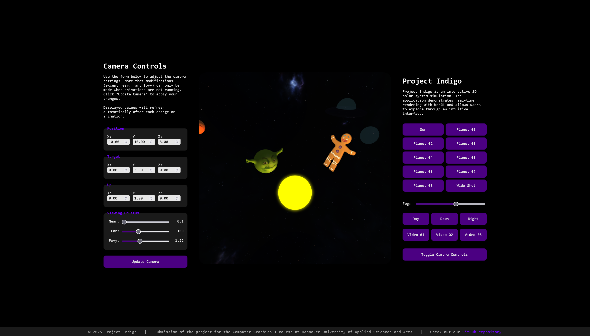

# Project Indigo
This project was developed over a period of one month by four students ([Farina](https://github.com/frinnana), [Felix](https://github.com/7dns), [Jana](https://github.com/janawut) and [Victoria](https://github.com/Victoria-We)) as part of the fourth semester module "Computer Graphics 1" in the Bachelor's program Media Design Computing at Hanover University of Applied Sciences and Arts, Germany.

The project involved creating a WebGL demo with an interactive 3D scene that showcased techniques from the course such as lighting, texturing, and animation. All code was self-developed, documented, and presented in a clear, functional program with a README explaining usage and sources.

## Starting and Using the Program
To start the application visit [https://7dns.github.io/indigo/](https://7dns.github.io/indigo/).

The scene was developed and tested in Mozilla Firefox. For the best experience, maximize the browser window and set the zoom level to 100%. The application is designed for use in horizontal (landscape) mode.

The control panel to the right of the 3D scene allows you to manage several functions: you can switch between preset camera perspectives, adjust the fog, select a skybox, choose a video for Planet 06, and enable additional camera controls.

Additional camera settings appear after clicking to the left of the 3D scene. There, you can manually define the camera’s position, target, and up direction, as well as adjust the near plane, far plane, and field of view (fovy) parameters.

## Scene Overview
This interactive 3D scene simulates a solar system. The scene includes a sun, multiple planets with different textures, a UFO, and a gingerbread man. The planets orbit around the sun and rotate on their own axes. Lighting, fog, and bloom effects contribute to an atmospheric presentation. The background can be switched between various skybox textures (day, night/galaxy, dusk). The camera can be controlled via the user interface.

Each planet demonstrates specific techniques:
- Sun: Bloom
- Planet 01: Image texture (Shrek)
- Planet 02: Second light source (emits orange light)
- Planet 03: Multitexturing with two image textures (Earth)
- Planet 04: Transparent
- Planet 05: Reflective
- Planet 06: Video texture (choice of three videos; the second is a 360° video, the third includes audio)
- Planet 07: Image texture (Saturn)
- Planet 08: Procedural texture
- UFO: Reflective and transparent
- Gingerbread Man: Image texture

In addition to the basic requirements, the following extended techniques are implemented:
- Scene lighting with multiple light sources
- Simultaneous use of multiple textures on a single object
- Use of multiple shader programs within one scene
- Transparent objects
- Use of environment textures
- Environment reflections on certain objects
- Fog in a complex 3D scene
- Use of a video texture

Advanced techniques include:
- Bloom effect
- Procedural texture generation

## References
- Favicon: Unicode, Apple via [Emojipedia](https://emojipedia.org/apple/ios-18.4/ringed-planet) (last accessed: June 17, 2025)
- Models (BasicPlanet.obj, CookieMan.obj, SaturnPlanet.obj, SaturnRing.obj, ShrekPlanet.obj, UfoGlass.obj, UfoShip.obj): self-modeled
- Textures:
  - RainbowTexture.png: via [Reddit](https://preview.redd.it/was-bored-so-i-made-a-road-texture-concept-for-wii-rainbow-v0-jx2xoqanszsb1.png?width=1024&format=png&auto=webp&s=41f738855f7b62ad4b01c236ac8a8ec3e21d7a5b) (last accessed: June 19, 2025)
  - Saturn.png: via [Wikipedia](https://upload.wikimedia.org/wikipedia/commons/1/1e/Solarsystemscope_texture_8k_saturn.jpg) (last accessed: June 19, 2025)
  - ShrekTextureFace.png: via [Amazon](https://m.media-amazon.com/images/I/51wmBVio3tL.jpg) (last accessed: June 19, 2025)
  - Earth Textures: via [NASA Visible Earth](https://www.visibleearth.nasa.gov/) (provided via Moodle, last accessed: June 18, 2025)
  - Skybox Dawn: Greg Zaal - "Rogland Clear Night" via [Poly Haven](https://polyhaven.com/a/rogland_clear_night) (last accessed: June 18, 2025)
  - Skybox Day: Learn OpenGL - "Cubemaps" via [Learn OpenGL](https://learnopengl.com/Advanced-OpenGL/Cubemaps) (last accessed: June 18, 2025)
  - Skybox Night: Space Spheremaps - "HDRi Space Spheremaps" via [Space Spheremaps](https://www.spacespheremaps.com/hdr-spheremaps/) (last accessed: June 18, 2025)
- Videos:
  - Video 01: Avoid at All Costs - "The entire bee movie but every time they say bee it gets faster" via [YouTube](https://www.youtube.com/watch?v=W31e9meX9S4) (last accessed: June 17, 2025), *Bee Movie*, 2007 © DreamWorks Animation
  - Video 02: BRIGHT SIDE - "Minecraft 360° VR Extreme Roller Coaster Ride Will Trick You" via [YouTube](https://www.youtube.com/watch?v=Dk96JTfpSYc) (last accessed: June 18, 2025), *Minecraft*, 2011 © Mojang Studios
  - Video 03: M0vie - "Shrek - All Star | Intro HD (1080p)" via [YouTube](https://www.youtube.com/watch?v=HLQ1cK9Edhc) (last accessed: June 18, 2025), *Shrek*, 2001 © DreamWorks Animation
- Procedural texture inspired by: nimitz - "Noise animation - Lava" via [Shadertoy](https://www.shadertoy.com/view/lslXRS) (last accessed: June 18, 2025)
